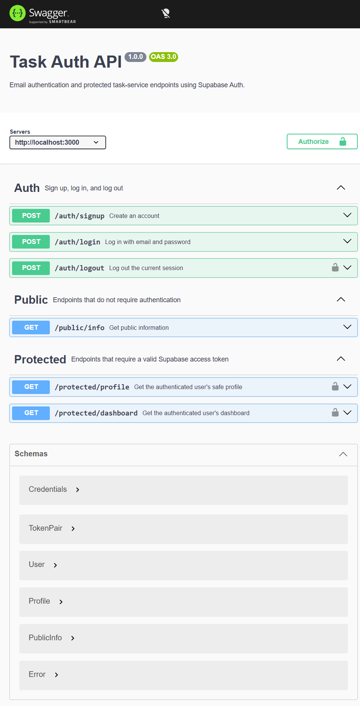

# Supabase Auth API

A Node.js and Express API that delegates account creation, password authentication, JWT verification, and session logout to Supabase Auth. The server does not store passwords or implement cryptography.

## Setup

Requirements: Node.js 22 or newer and a Supabase project.

1. Clone this public repository and install packages:

   ```bash
   npm ci
   ```

2. Copy `.env.example` to `.env` and fill in the values from your Supabase project settings:

   ```powershell
   Copy-Item .env.example .env
   ```

   Set `SUPABASE_URL`, the Supabase **anon/public** key as `SUPABASE_KEY`, and `PORT=3000`. Never use the `service_role` key. For this practice assignment, disable **Confirm email** in the Supabase project's Auth settings so a new account can log in immediately.

3. Start the API with the single command:

   ```bash
   npm start
   ```

The API listens at `http://localhost:3000`. The `.env` file is ignored by Git; commit only the placeholder `.env.example`.

## Endpoints

| Method | Path | Authentication | Success | Description |
| --- | --- | --- | --- | --- |
| POST | `/auth/signup` | No | 201 | Create an account with `{ "email": "...", "password": "..." }` |
| POST | `/auth/login` | No | 200 | Log in; returns `access_token` and `refresh_token` |
| POST | `/auth/logout` | Bearer JWT | 204 | Revoke the current session |
| GET | `/protected/profile` | Bearer JWT | 200 | Return verified user ID, email, and creation date |
| GET | `/public/info` | No | 200 | Return the public welcome message |
| GET | `/protected/dashboard` | Bearer JWT | 200 | Example of another middleware-protected route |

Missing credentials return `400`; invalid login credentials return `401`. Protected routes return `401` when the token is missing, malformed, invalid, or expired.

Example signup request:

```bash
curl -i -X POST http://localhost:3000/auth/signup \
  -H "Content-Type: application/json" \
  -d '{"email":"person@example.com","password":"your-password"}'
```

To log in, send the same email/password fields to `POST /auth/login`, then use its `access_token` as `Authorization: Bearer <access_token>` for protected routes.

## Swagger UI

Open [http://localhost:3000/docs](http://localhost:3000/docs). Use **Authorize** to paste the access token returned by login, then choose **Try it out** on `GET /protected/profile`. The OpenAPI document is also available at `/openapi.json`.



## Book enrichment endpoint

`POST /enrich` accepts a book title and description, then returns a fixed category, factual short summary, and quality flags. Set `LLM_STUB=1` in the server environment to use the deterministic response during development; stub mode makes no model calls.

Valid request:

```bash
curl -i -X POST http://localhost:3000/enrich \
   -H "Content-Type: application/json" \
   -d '{"title":"A Sample Book","description":"A short story about a family adventure."}'
```

Invalid request (missing `description`, expected `400`):

```bash
curl -i -X POST http://localhost:3000/enrich \
   -H "Content-Type: application/json" \
   -d '{"title":"A Sample Book"}'
```

### Prompt v1 smoke test

Three fake inputs were sent to the real OpenRouter-backed endpoint on 2026-10-04:

| Input case | Observed output |
| --- | --- |
| `Garden Birds` with a clear field-guide description | `nonfiction`; summary reflected the supplied details; no quality flags |
| `The Blue Door` with a vague journey description | `other`; `unclear_category` and `sparse_description` |
| `Quiet Star` with a null description | `other`; `missing_description` and `unclear_category` |

All three responses returned `200` and matched the closed output schema. The missing-description result did not infer a category from the title, which is the intended conservative behavior.

## LLM reliability controls

- Set `LLM_ENABLED=false` to return `503` without making a model call. `LLM_STUB=1` remains available for deterministic development responses.
- Each model request has a 30-second timeout; exhausted timeouts return `504`.
- The OpenAI SDK's automatic retries are disabled (`maxRetries: 0`). The application retries only timeouts, `429`, and `5xx`, at most three times, using exponential delays of 1, 2, and 4 seconds plus jitter. A valid `Retry-After` header takes precedence. `400`, `401`, and `403` are not retried.
- Each model attempt emits a structured JSON log with prompt version, model, input/output token counts, duration, and whether it was a repair call.